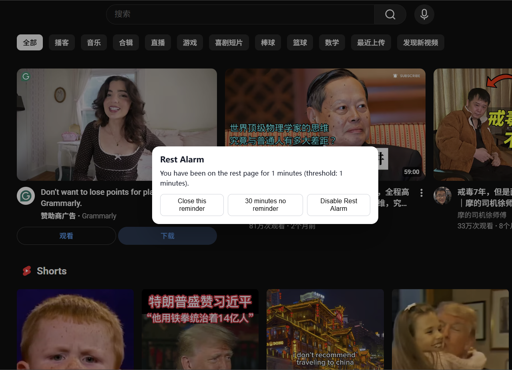

# 🧠 Working Mode — Smart Web Focus & Rest Tracker

> A lightweight Chrome extension that classifies your browsing with Gemini AI, tracks focus time, and reminds you to take breaks from breaks :).

---

## 🌟 Features

- **AI-based Website Classification**  
  Uses Google Gemini models (e.g., `gemini-2.0-flash`) to categorize every site into  
  `work / study / utility / social / entertainment / other`.

- **Automatic Time Tracking**  
  Logs how long you spend on each category and domain per day,  
  with pie charts and tables in the popup panel.

- **Rest Alarm Reminders**  
  Detects when you stay too long on “rest” sites and pops up an in-page modal to remind you to take a break.  
  If a page blocks scripts (e.g. Chrome internal pages), it falls back to a toast or system notification — you’ll always get a reminder.

- **Full Customization**  
  Add, rename, or delete categories and umbrellas (work / rest / other),  
  assign colors, and adjust your rest interval and time zone.

- **Persistent Stats & Exports**  
  Data is stored locally with optional daily aggregation; you can export as `.txt` for analysis or journaling.

---

## 🖼️ Screenshots

| Popup Panel | Settings Page | Rest Alarm Modal |
|--------------|---------------|------------------|
|  |  |  |

---

## ⚙️ Installation (for Developers)

1. **Clone or Download** this repository.  
2. Open Chrome → `chrome://extensions/`  
3. Enable 🧩 **Developer mode** (top-right corner).  
4. Click **“Load unpacked”** and select the project folder.  
5. Optionally add your **Gemini API Key** in Settings → *Gemini API Key*.  
6. Reload the extension.

---

## 🔑 Optional Gemini Setup

1. Go to [Google AI Studio](https://makersuite.google.com/app/apikey) and generate an API key.  
2. Copy it into the extension Settings → **Gemini API Key** field.  
3. Choose a model (e.g. `gemini-2.0-flash`, `gemini-2.0-pro`).  
4. Save and reload the extension.

> If no API key is set, Working Mode uses its built-in heuristics and whitelist rules for classification.

---

## 🕒 How Rest Alarm Works

1. The background service tracks your current category and switch time.  
2. When you stay in any `rest` umbrella category (e.g. social / entertainment) beyond the threshold (5 min by default),  
   the extension tries to show an in-page modal:  

   - ✅ First try: send `SHOW_REST_MODAL` to the current tab  
   - 🔄 If blocked: auto-inject `content.js` and retry  
   - 💬 If still blocked: display a toast or system notification

3. You can choose to **close once**, **snooze 30 minutes**, or **disable** the reminder.

---

## 📊 Popup Overview

- **Current Category** and Domain  
- **Pie Chart** of time spent by category  
- **Top Domains Table**  
- **Manual category switch** and **Rest Alarm toggle**  
- **Data Export** (`.txt`, timezone-aware)

---

## 🧩 File Structure

.
├── manifest.json
├── background.js        # Service worker (classification + rest alarm)
├── classify.js          # Gemini API call & heuristics
├── content.js           # In-page modal + toast
├── popup.html
├── popup.js
├── options.html
├── options.js
├── icons/
└── README.md

---

## 🪄 Customization Tips

- To change the default interval or time zone, edit them in `Settings → Rest Alarm Interval / Time Zone`.  
- Add new categories (e.g. `english_learning`) in the Customize section and assign an umbrella.  
- Color codes auto-generate distinct hues but you can manually tweak them.

---

## 🧠 Tech Highlights

- Chrome Extensions Manifest V3 + Modules  
- Background alarms + content script communication  
- Dynamic script injection (`chrome.scripting`) for blocked pages  
- Local storage (sync & local) for persistent statistics  
- Fallback system notifications ensuring rest alarm visibility

---

## 🧩 Troubleshooting

| Symptom | Possible Cause | Fix |
|----------|----------------|-----|
| No rest modal shown | Page blocked content scripts | Working Mode auto-injects `content.js`; if still no popup, check the browser notification permission |
| Stats not updating | Service worker sleeping | Extension auto-runs a 1-minute “kicker” alarm to keep tracking |
| Gemini classification fails | Invalid API key or rate limit | Verify API key and model name in Settings |

---

## 📄 License

MIT License © 2025 Li Zheng
Feel free to use, modify, and share with attribution.

---

*(Add your own credits, badges, or screenshots below.)*

